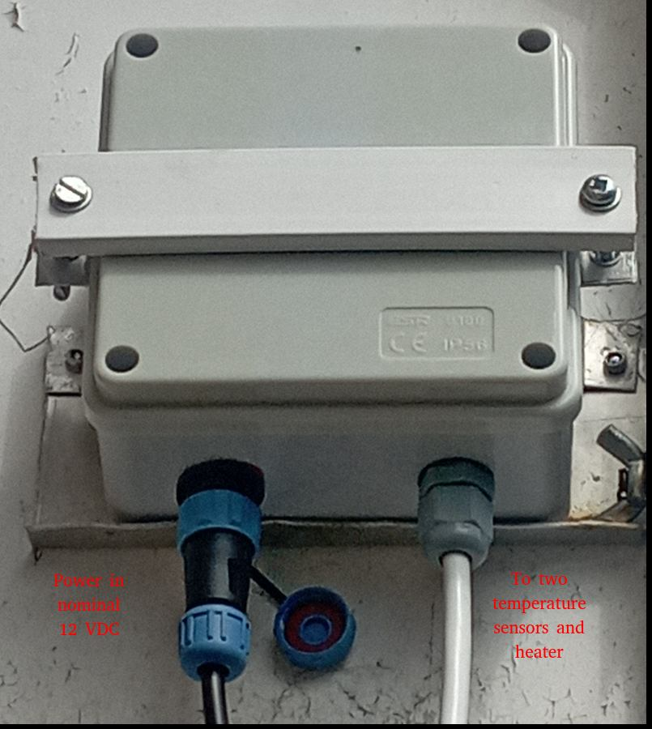
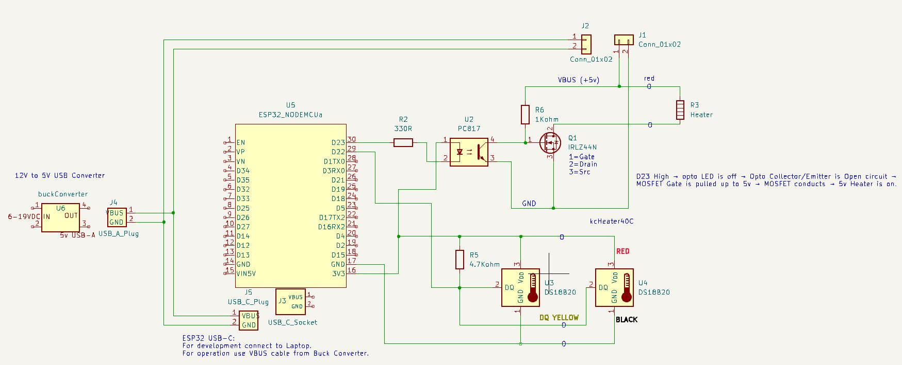
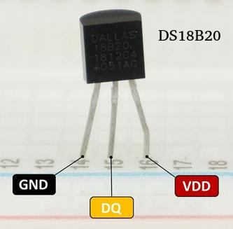
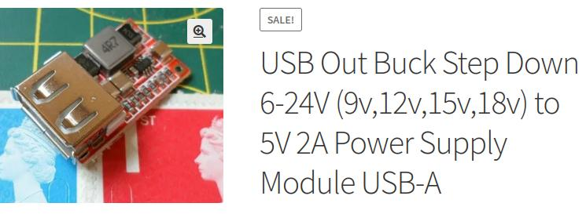
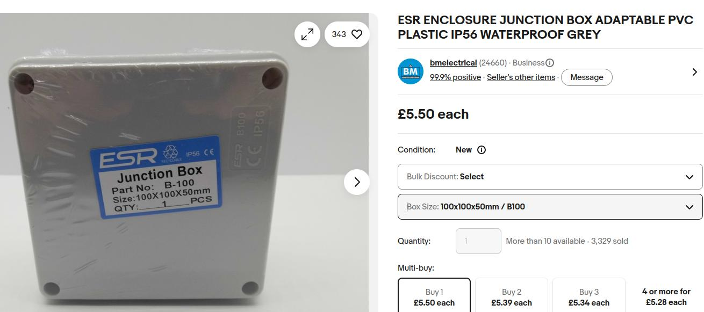
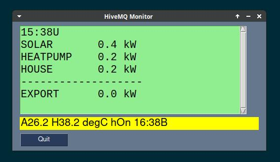
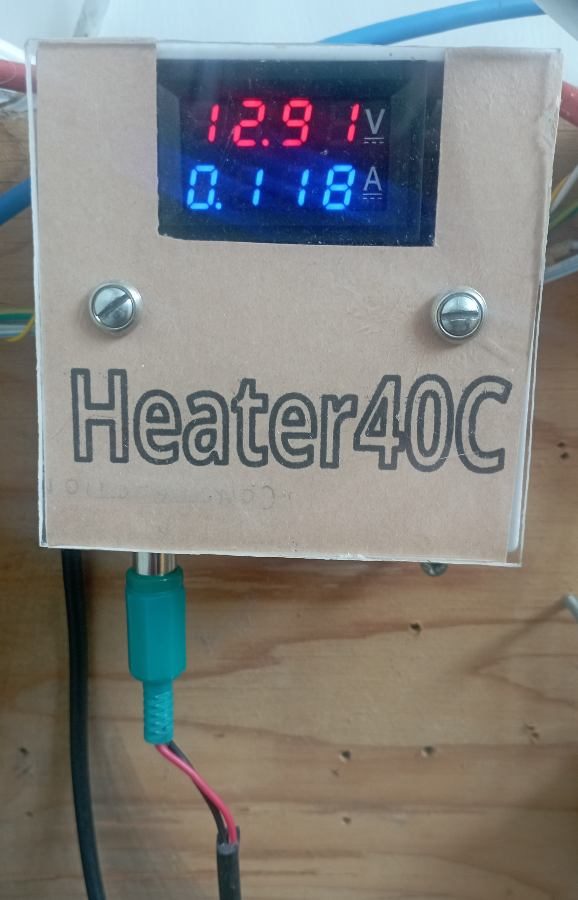
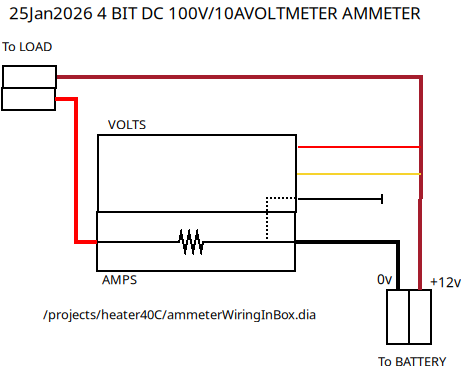
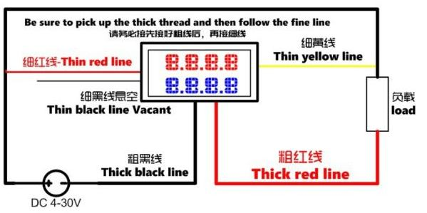
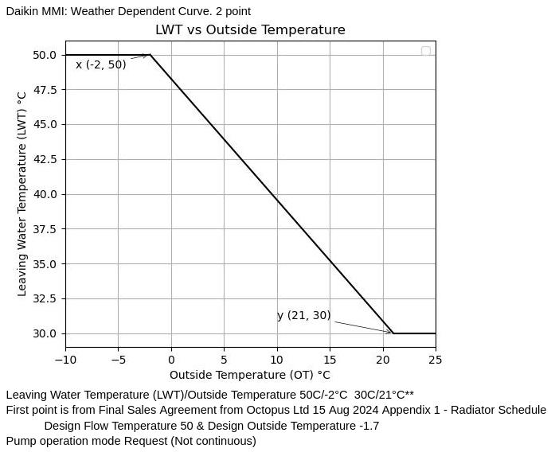

# heater40C

A MicroPython-based electronic project using high accuracy chainable temperature sensors.
A heater can be switched on or off remotedly.
One sensor measures ambient degC and other heater degC.
More temperature sensors can readily be added.

## Equipment

#  
The assembled project shown outdoors. The temperature sensors and heater are external to the control box.

## Project Overview

This project uses an ESP32 to obtain temperature data that is transmitted to other systems via MQTT.
Remotedly a heater can be turned off and on limited to a set threshold temperature witha maximum of 40 degC.

## Software

- Written in MicroPython
- heater40C.py is main program needing
- other shared modules with filenames starting with mod

## Circuit
  
20250817kcHeaterschematic.jpg

## Component List

NodeMcu ESP32 WROOM-32 Type C CH340C Development Board Dual Core WiFi Bluetooth

  
DS18B20 pinout DS18B20pinout.jpg  

  
IRLZ44N pinout 1/2 IRLZ44Npinout1.jpg  

  
IRLZ44N pinout 2/2 IRLZ44NpinoutVishay.jpg  

  
pc817 Optocoupler pinout pc817pinout.jpg  

  
viztech 5v USB out Step Down Power Supply 5vUSBoutStepDownPowerSupply.jpg  
https://viztech.co.uk/product/down-usba/  

  
Waterproof box (if mounted outside)  
Ebay Example: ESR ENCLOSURE JUNCTION BOX ADAPTABLE PVC PLASTIC IP56 WATERPROOF GREY  
100mm x 100mm x 50mm  

USB Cable A plug to USB C plug: One short during operation and one long for development.  

**IMPORTANT** In operation use a short USB A plug to USB C plug to drive the ESP32 and some of the circuitry.  
The built in Step Down Power Supply powers the complete circuit during normal operation.  
Whilst developing under say Thonny disconnect the heater (the banana plug and socket in line with the heater element) and power the ESP32 instead from a laptop via the longer USB cable.  
This is important to avoid overloading the laptop USB socket with the heater element drawing current.  

## How It Works

Temperature readings will be sent periodically together with a hh:mm timestamp to show the readings are fresh.  
The /rh command must be sent regularly to keep the heater on, a fail safe feature. See comments at top of heater40C.py  

  
Display of Output From MQTT subscribing (displayOfOutputFromMQTTsubscribing.jpg)  
See bottom yellow band A=Ambient H=Heater temperatures

## Installation

The ESP32 was programmed using Thonny on a Linux Xubuntu system. Thonny is available for Windows, macOS and Linux, so the same MicroPython development environment can be used regardless of the computer's operating system.
Alternatives exist but Thonny as the simplest cross-platform choice.
A USB cable simply connects the ESP32 to a USB port on say a laptop.
An easy way to work is to copy and paste entire master file contents from laptop to Thonny when making changes.
Once deployed modOTAserver can be used to make changes over the air to any file stored on the ESP32 flash.

## Configuration

Some modules need setting up. A header in each module gives notes on setup.

1) **modWiFi**  
wifi_entries.dat holds WiFi connections credentials. For a fixed system just one line Entry is needed. The format is like:
SSID::PASSWORD::Region
SSID and PASSWORD can contain a large range of characters including a space character.
Region is a single uppercase letter. L=London time and P=Paris time 
The file is then saved in ESP32 flash.
See module's top comments for further information.

2) **modMQTpub**  
mqcons.py here is a template to be filled in with data from an MQTT server such as HiveMQ, and saved in ESP32 flash.

```python
gsFilNom = "mqcons.py" #Written in MicroPython for ESP32 WROOM
gsVEERSN = gsFilNom + " V001" # Add send to MQTT server
sBrokerHost = "xxxxxxxxxxxxxxxxxxxxxxxx.s1.eu.hivemq.cloud"
iBrokerPort = 8883
sMqttUser = "yourUser"
sMqttPassword = "yourPass"
# ----END----
```

3) **modDateTime**  
Write the daylight saving string defined at the start of the module
into a file named "dst.rule" and save in ESP32 flash.

4) **modKeepAlive**
See top comments for usage

5) **modOTAserver**
See top comments for usage

## Test Setup

The two temperature sensors with heater off should send back similar data if not far apart and under same conditions e.g. shade wind
See comments at top of heater40C.py for command testing.

## Indoor Power Supply
This allows monitoring of the heater current and supply voltage to the remote sensing unit that can be outdoors on a long length of twin cable (black wire left bottom).  
The green phono plug (bottom left) is the supply input, here connected via a 1 Amp fuse to a 12v Leisure battery on trickle charge.  

  
ammeterVoltmeter.jpg 4-Bits 100V/10A  

  
heater40CpowerAmmeterMonitor.jpg  
red blue 4 'bit' selected.  
Has thinwire: red yellow black, thickwire red and black  

  
ammeterWiringInBox.png (see also original ammeterWiringInBox.dia)  
``` 
Battery +12V -> thick red -> SHUNT -> thick black --> Heater --> Battery 0V  
Thin red ------------------------> Battery +12V (meter power)  
Thin black ----------------------> Battery 0V (meter ground)  
Thin yellow ---------------------> optional Battery +12V (voltage reading)
--> is long cable
```  
If voltage sensing yellow is disconnected the meter cannot measure voltage and the voltmeter portion stays blank or shows 0 V.

  
ammeterCircuit.jpg  

## Original Usage
This equipment is being used to remote control a Daikin Altherma heat pump without making any direct electrical connections to the Daikin equipment.  
The Leaving Water Temperature (LWT) of hot water entering the house into the radiators depends on the outside air temperature (OT) mostly setup a a linear function.  


heatPumpLWTversusOT.jpg  

By adjusting OT we can affect LWT. If we don't want radiator heat OT can be raised to its maximum.  
This gets around the problem where installers fit a single indoor thermostat often by the front door to control a complete house.  
We can now distribute hot radiator water to zones as needed, effectively turn off or wind down the heat pump when not needed and bypass the Daikin central thermostat with its not highly accurate temperature sensor.  

## Version History

Each MicroPython file has Filename and Version in the first two lines.
